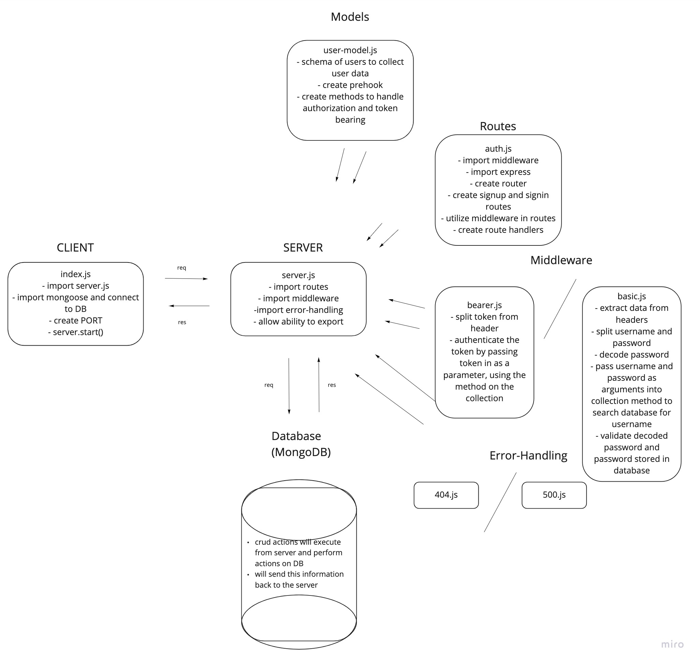

# LAB - Class 07

## Project: Beaerer Authorization

### Author: Jenner Dulce

### Links and Resources

- [ci/cd](https://github.com/jennerdulce/bearer-auth/actions) (GitHub Actions)
- [Pull Request](https://github.com/jennerdulce/bearer-auth/pull/2)
- [HEROKU App](https://jennerdulce-bearer-auth.herokuapp.com/)

### Setup

#### `.env` requirements (where applicable)

- `PORT` - 3000

#### How to initialize/run your application (where applicable)

- `nodemon`
- `node index.js`
- `npm start`

#### How to use your library (where applicable)

#### Tests

##### Assert the following

- Tests were a given and our objective was to ensure that they work. (they work)

#### UML

;
